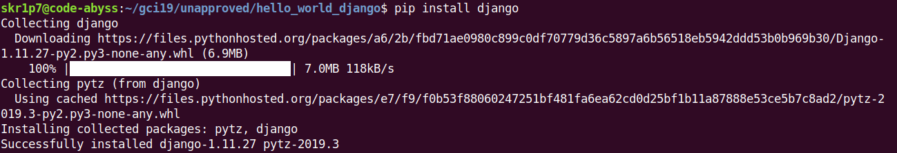
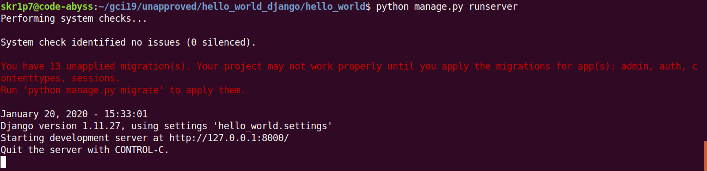
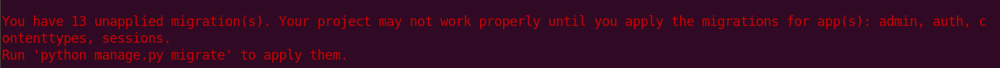
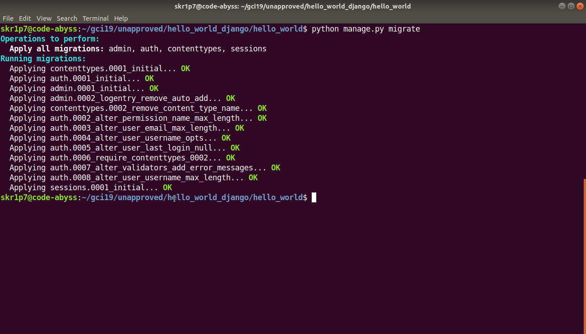
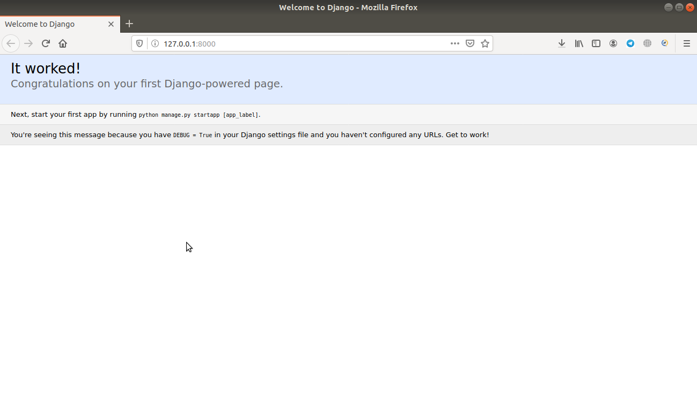
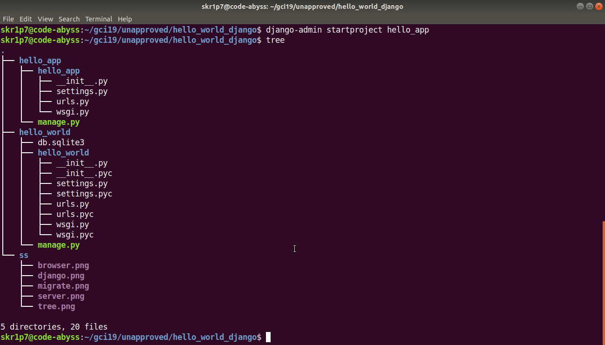
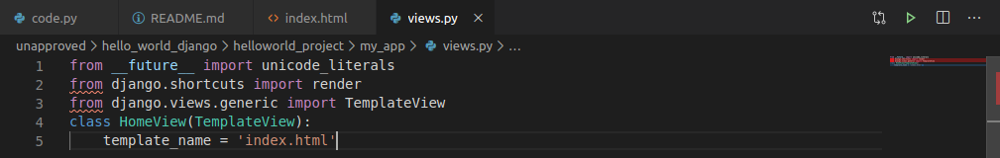
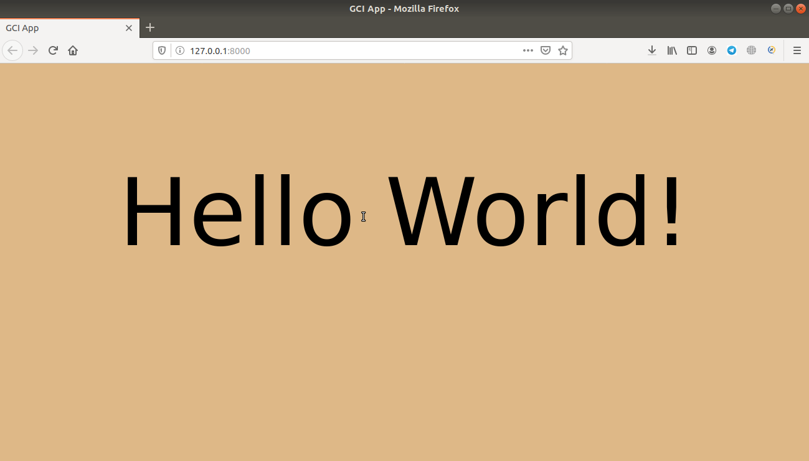

# Django Hello World 101

In this tutorial, we will learn how to create a simple Django app that show Hello World
Prerequisites are:
* Python 2.7
* Django

To install Python2, use the following command in your terminal:

```bash
$ sudo apt-get install python
```

To install Django through pip, firstly we need to have pip installed, use the following command to install pip:

```bash
$ sudo apt install python-pip
```

Up next we will install Django via **pip**. Use the follwing commmand:

```bash
$ pip install django
```


 
Let's not create a new directory where we will make our project, use the following command to make a driectory which I am naming as **hello_world_django** using the commands given below:

```bash
$ mkdir hello_world_django
```

Navigate to the **hello_world_django** directory using the following command:

```bash
$ cd hello_world_django
```

Before working on our main app, we will first create a demo app to check if Django is working as it is supposed to or not, for this we will create a new app called **helloworld_project**
Use the following command to get started:

```bash
$ django-admin startproject helloworld_project
``` 

We will run the ```tree``` command to varify the directory structure in the **hello_world_django** directory and the output should look something like this:

```bash
└── django_hello_world
    ├── helloworld_project
    │   ├── __init__.py
    │   ├── settings.py
    │   ├── urls.py
    │   └── wsgi.py
    └── manage.py
```

As the app is created, let's navigate into the *helloworld_project* directory and start the server.

```bash
$ cd helloworld_project

$ python manage.py runserver
```



Here we can see some migration errors that look like this:



We can easily fix them using the following command:

```bash
$ python manage.py migrate
```



Let's now navigate to *localhost* or *http://127.0.0.1:8000* to see if our app works.



### Viola!

Now that we know that our app works, let's head up to create our main *Hello World* app.
Let's navigate back to the hello_world_django directory and run the following command:

```bash
$ django-admin startapp my_app
```

Running the tree command again to see the project structure, here is how it should look, do ignore the **ss** folder as it is not the part of the project



Our app is now ready but we need to let Django know about our new app, to do that follow the commands given below:

```bash

$ cd ..

$ cd helloworld_project

```

Let's open the *settings.py* file in a text editor, initially the file looks likw this:

```python
INSTALLED_APPS = [
    'django.contrib.admin',
    'django.contrib.auth',
    'django.contrib.contenttypes',
    'django.contrib.sessions',
    'django.contrib.messages',
    'django.contrib.staticfiles',
]
```

We have to add the directory of our *my_app* in the **INSTALLED APPS**, delete everything inside the **INSTALLED APPS** array and copy everything below and add inside the square brackets

```python 
	'django.contrib.admin',
    'django.contrib.auth',
    'django.contrib.contenttypes',
    'django.contrib.sessions',
    'django.contrib.messages',
    'django.contrib.staticfiles',
    'my_app',
```

Now let's create the *index.html* page for our app which will render our *Hello World*.
Use the following commands to:

* Come out of **helloworld_project** directory
* Navigate to **my_app** directory
* Create a **templates** directory
* Make an *index.html* page

```bash
$ cd ..

$ cd my_app

$ mkdir templates

$ touch index.html
```

Copy the HTML code below and paste them inside the *index.html* file

```html
<!DOCTYPE html>
<html lang="en">
<head>
    <meta charset="UTF-8">
    <meta name="viewport" content="width=device-width, initial-scale=1.0">
    <meta http-equiv="X-UA-Compatible" content="ie=edge">
    <title>GCI App</title>
    <style>
    p {
        text-align: center;
        font-family: 'Segoe UI', Tahoma, Geneva, Verdana, sans-serif;
        font-size: 150px;
    }

    body {
        background-color: burlywood;
    }
    </style>
</head>
<body>
    <p>Hello World!</p>
</body>
</html>
```

Now we have to set the route to our freshly created *index.html* page. For that we will get inside the *my_app* directory, and clear everything inside the **views.py** file and add the code that is given below

```python
from __future__ import unicode_literals
from django.shortcuts import render
from django.views.generic import TemplateView
class HomeView(TemplateView):
    template_name = 'index.html'

```

Up next we will have to tweak the **urls.py** file inside the **helloworld_project** folder and add the following line inside the **urlpatterns** array:

```python
url(r'^$', HomeView.as_view()),
```

Also we need to import HomeView in the same file by adding the following lines on the top codeblock of **urls.py**

```python
from my_app.views import HomeView
```

It should now look something like this



### Final mission!

As we are done with all the tweaks, additions, deletions etc. Now it's time to run our app.
For doing the same we need to come out to the main directory that says **hello_world_django** and run the command below to start our app.

```bash
$ python manage.py runserver
```

Let's navigate to ```http://127.0.0.1:8000``` and you should see something like this:



### Thanks!

### Find me on [Twitter](https://twitter.com/0xskr1p7)
